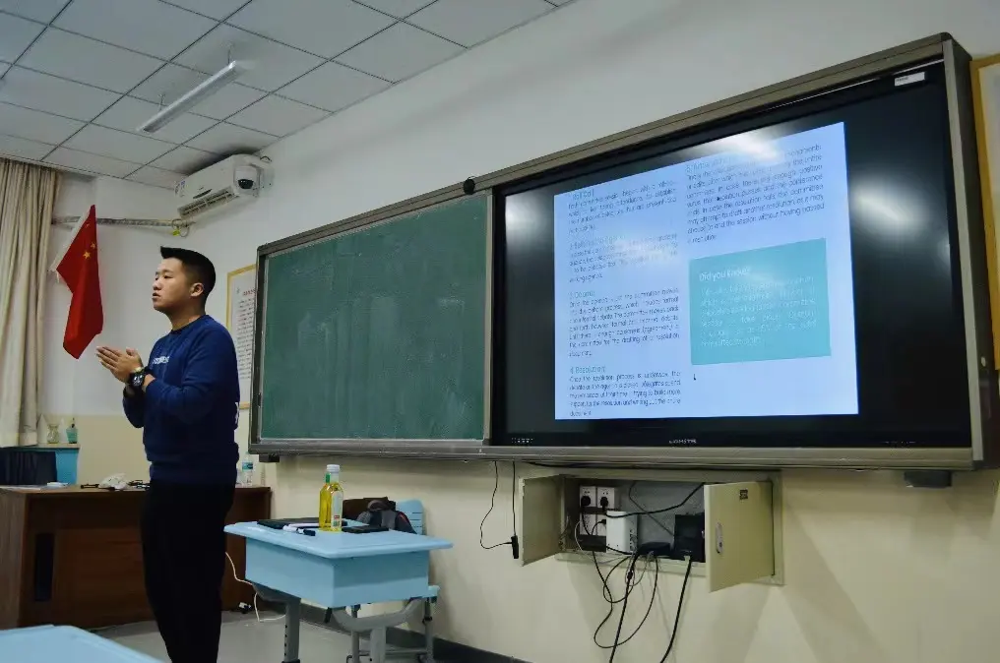
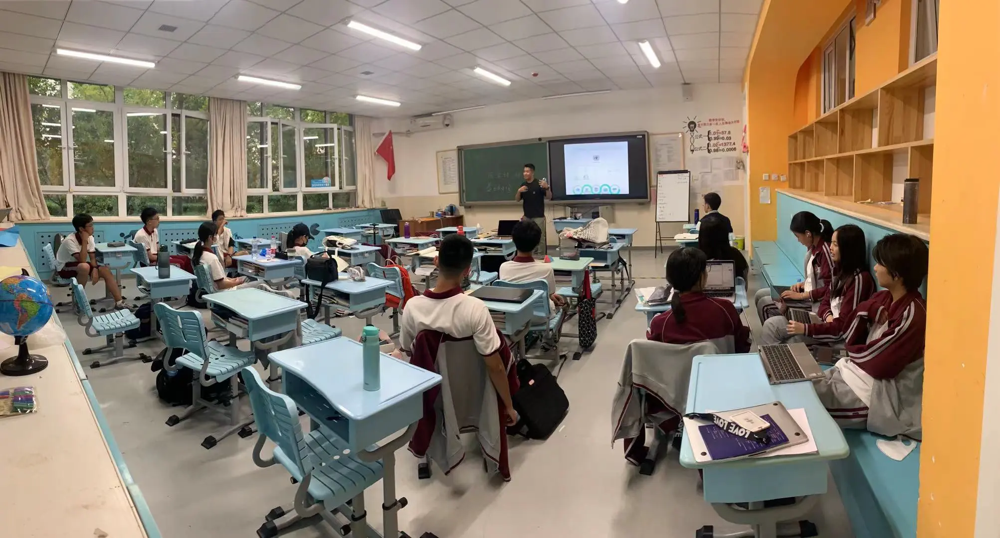
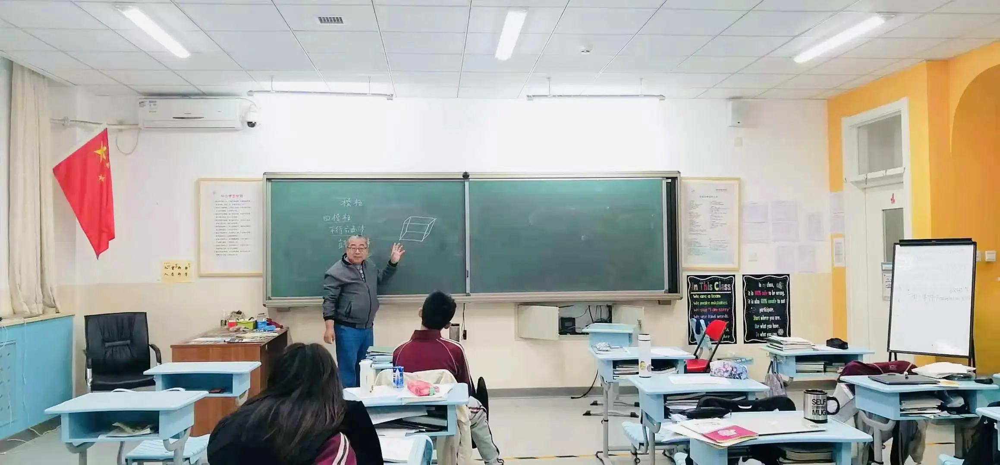
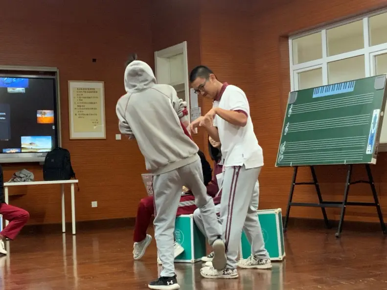
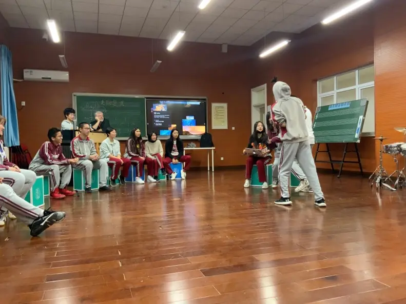
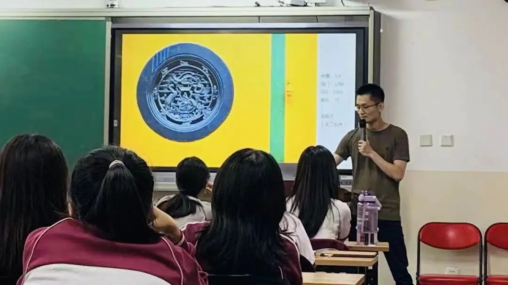
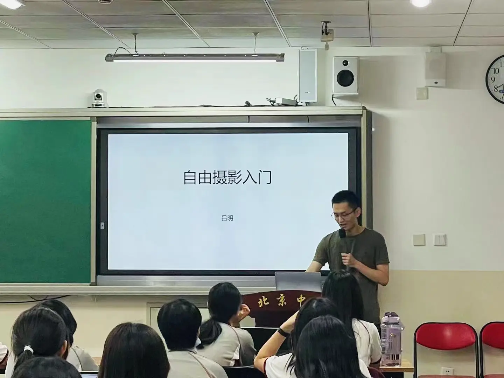
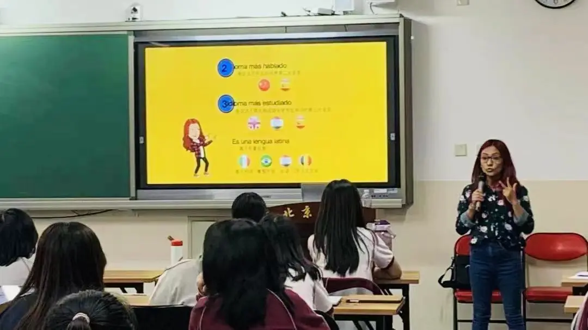
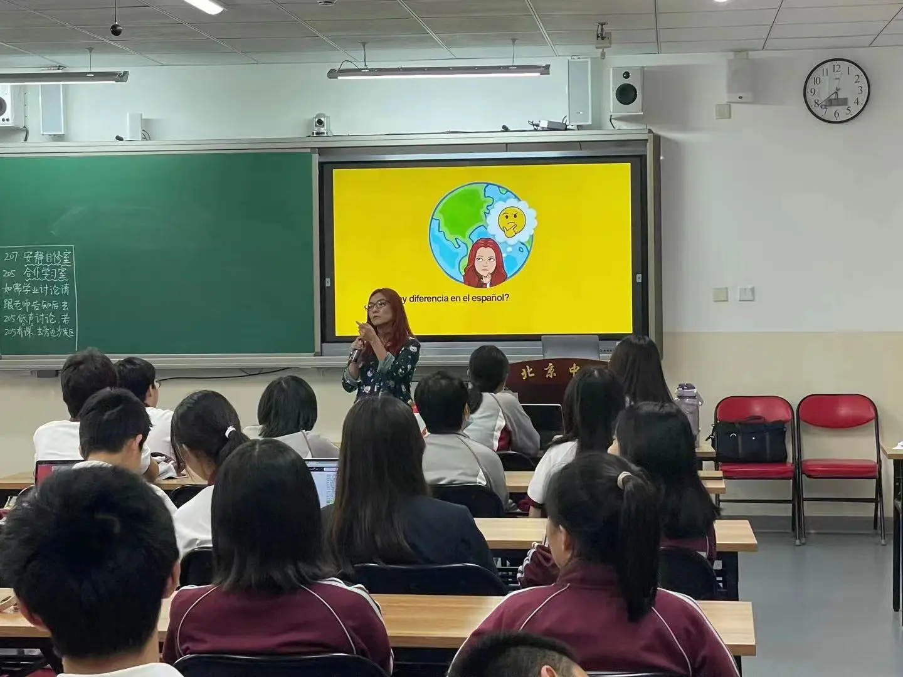

## 模拟联合国

模拟联合国以前在我的印象里是一个很高大上的活动，充满了威严和神秘的气息。而事实上也确实如此。目前在大河老师的指导下，我们初步了解了联合国会议的一些基本机制。让我感到一些惊讶的是，不只是国家的议案、倡议需要由全场代表投票表决，大会今天讨论的主题和是否开会都需要通过投票表决。而且为了保证绝对的公平和平等，每场大会的坐席都不是固定的，这样保证每个代表有议案要提出的时候不会被主席漏看。有时为了确保民主，需要花费很长的时间才能商量出结果来，而且还有很多联合国大会，无论是模拟还是真实会议，往往都没有通过什么议案。目前我们还没有什么实战练习，但光是通过讲解规则，我就有一定的感想：很多收入较低的人不愿意参与民主讨论，因为讨论时间往往太长，而且最后也没有商量出什么方法，占用了他们的工作时间而且还没什么收益。如果对参加民主商讨的人们提供一些补偿，那么他们很多人的积极性便能被调动起来。 ——王嘉川

刚开学的时候，看到有模拟联合国这个选修课，感到非常兴奋。联合国对我来说一直是一个非常威严，且有点神秘的组织，虽然经常出现，每个人都熟知联合国的大名，但是我却一直

## 数学几何选修课

数学几何选修课是石老师基于平时上课内容的拓展课堂。他发现我们国际部所学和所考的内容与国外体系下的教学内容是有差异的。国外的体系着重在algebra，对geometry的研究很少，为了培养孩子们的几何思维，因此设置了几何选修课。我本身对数学比较抵触，但是在老师的鼓励下还是选择了这门课。石老师很和蔼，他丰富的教学经验让他可以手写出我们所有的测试题，平素的风格兼备了数学的严谨和趣味性。他十分热情，在课间的时候甚至会主动邀请同学们去问他题目，耐心细致的讲解。到现在，选修几何上我们所学的有关点、面、各种物体的形状和分类都是对课堂强劲有力的补充。 ——吴文博

在基础几何的课堂中，石老师向我们讲解了立体几何的数学内容，课堂丰富有趣的数学知识，总能引发同学们认真的思考和讨论。随着学习的深入，我们对几何图形的认识不再拘泥于二维的平面中，立体图形的出现使我们获得了一种看待几何图形的全新方式，这无疑大大激发了我们对于数学学习的兴趣，也增强了我们的思维能力与空间想象力。不仅课堂内容丰富有趣，和蔼可亲的石老师也是课堂中的一大亮点，在数学的学习中不断耐心的给予着我们最大的帮助。 ——战子川

## Drama

学校的选修课充实了我们的课余生活，在丰富多样的课程中我选择的是Mr. Daley的Drama。Drama是一个很考验即兴表演能力以及英语口语表达能力的课程，在课上我们每次都会进行有趣多样的表演小游戏，以及最后以几个人为一组的小型表演。在第一次上课时，我十分紧张不敢在大家面前展示自我，但受到老师的鼓励以及大家优秀表演的触动，我尝试变得活跃起来，融入其中。这门课程带给了我许多新的尝试，增强了我语言表达的自信以及表演能力，希望在以后的课程中我可以更好的展示自己，突破自己。 ——陈一戈

DC极其富有活力和创造力，几乎每节课每位节学生都得以即兴创作一小段drama并当堂表演。极高的课堂参与度让同学们纷纷放下羞怯，打开自我，以热情和反差诠释一个个有趣的小片段。Drama club带给我的不仅是spoken English的精进、对戏剧艺术化表达的理解，更是和大家一起笑得人仰马翻的极酣畅的课余放松。在轻松的氛围下，我看到了许许多多的“另一面”：端庄学姐的捧腹大笑，木讷同学的传神演绎，Mr. Daley的黑色幽默……常在心里感叹人的可能性真是无限的。只要有好的氛围和合适的舞台，人人都是drama star! ——刘柔希

## 摄影

世界的美好，也许需要某一种方式来记录。摄影，也许是一种好的方式。也许每个人都会拍照。但摄影，它是需要更多的细节的。在吕明老师的摄影课上，我们会学到最标准，最正规，最严谨的知识点，数据量和使用方法。在这里，你的问题都会被发现，每节课你都可以有许多的收获。主讲老师吕明老师，是一个很抓细节的老师，他会发现你的问题并教你如何规范使用。他也是一位很体贴的老师，他会给你送镜头湿巾，让你清理镜头。摄影记录了生活的美好，在摄影课上，你可以感受到获得知识后的美好。 ——李济彤

能够参与到吕明老师的摄影课，其实我的内心是非常激动的——因为这个课程可以报名的人数很有限，但是同学们的意愿又非常的大。在这里，你可以学习到专业的摄影基础知识。吕老师对待这个课程非常非常严肃认真！所以不要划水！！！（不交作业真的会被劝退）第一节课我们讲了曝光三要素之后还学习了曝光的控制，设备的选择等等等等。非常的专业并且教学逻辑很清晰。而且吕老师人也非常的nice，如果有摄影相关的问题或者想要交流摄影方面的内容的话，吕老师会很开心的。 ——苏溪语

## 西班牙语

西班牙语这门教师选修课充满着欢乐的气氛，老师Wendy是秘鲁人，母语就是西班牙语，而且还学了中文，在教学沟通上都有非常良好的基础和教学经验。我们从0基础入门开始一点一滴的积累，从不同部分的人称代词再到问候的小语句，时间虽然不长但真的学到了东西，而每次最有意思的却都当属我们轮流练习表达的时候，有的人的发音会奇奇怪怪，也会有说的磕磕绊绊，但Wendy都会莞尔一笑给我们纠正发音，而且时不时还会调侃“说的不对的可要上去跳舞哟！”。这种其乐融融的氛围拉近了国际部和国内方向同学们的距离，在同一间教室里学习，获取新知识，大家都很放得开，在大声跟读和欢声笑语中逐步深入西班牙语的学习，爱上西班牙语这门多彩的语言。 ——柳惠馨

北京中学之西班牙语课程是十分有趣味的。来自秘鲁的Wendy，是一位幽默有趣的老师。不仅西班牙语是非常标准的（因为是母语的缘故），更能用同学们喜欢的方式生动地讲述这些知识以及西班牙的文化。老师从最简单的词汇与对话入手，贴近日常之生活的同时没有语言类课程所存在的大量枯燥的知识点。其课堂气氛活跃，在其中全然无有走神者，竟让人热爱这门课程与这门语言。同学们在其中上课时或认真听课，或相互交流知识点，皆有所收获。 ——孙润生

