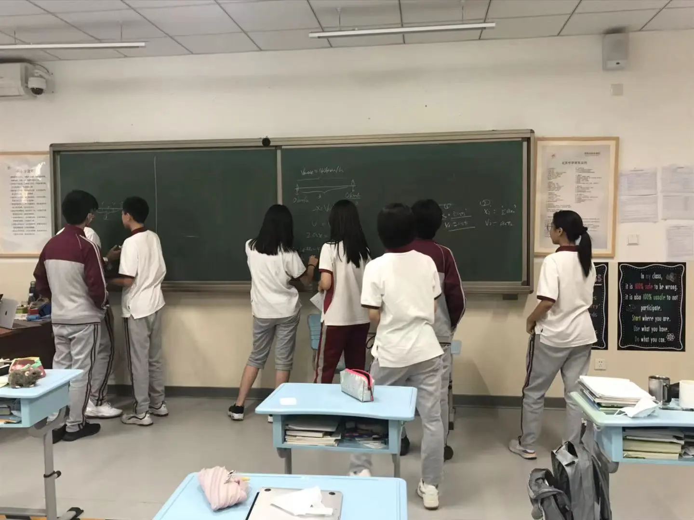
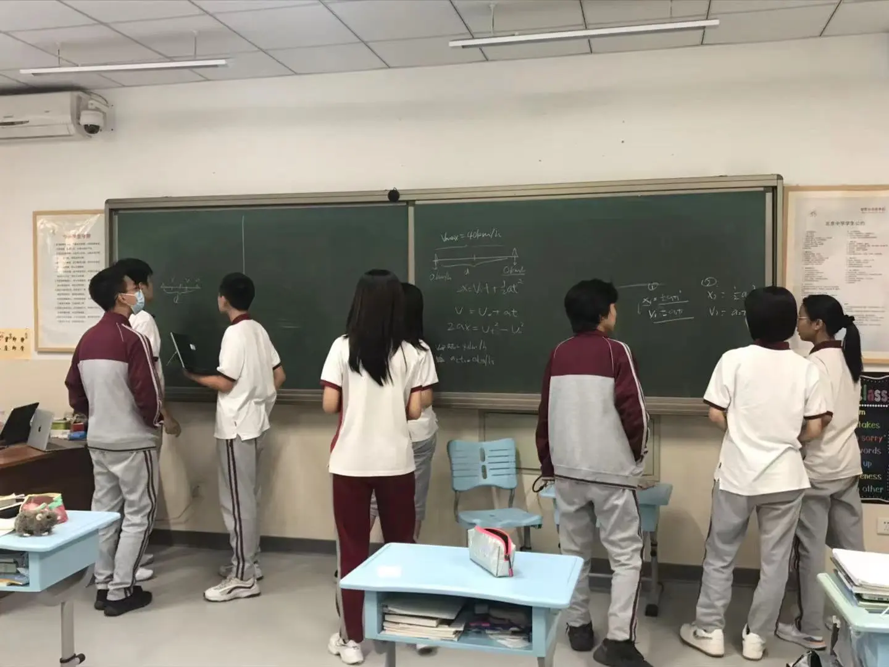
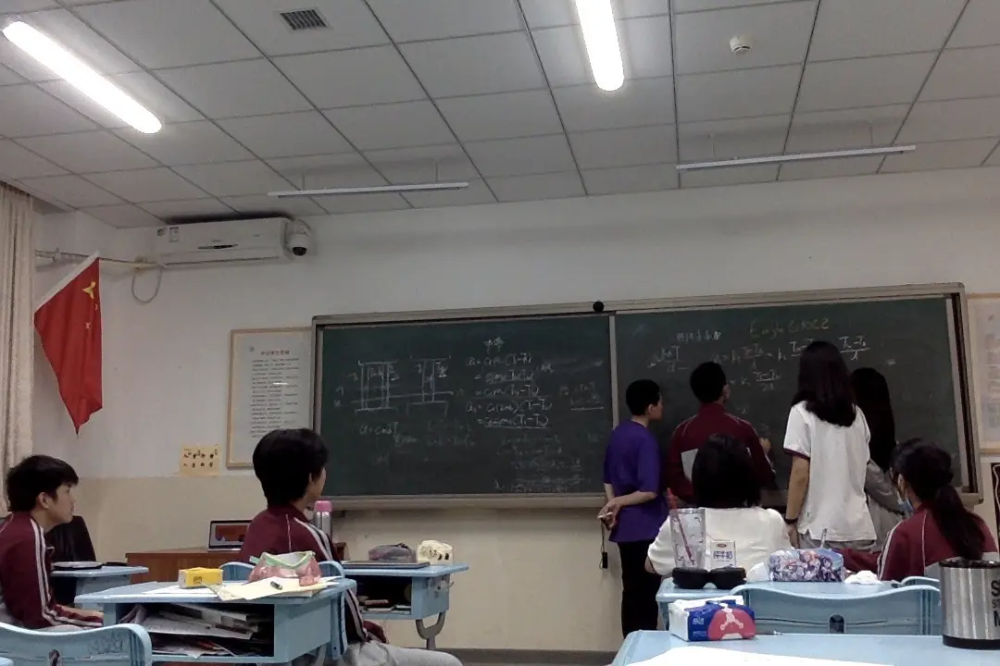
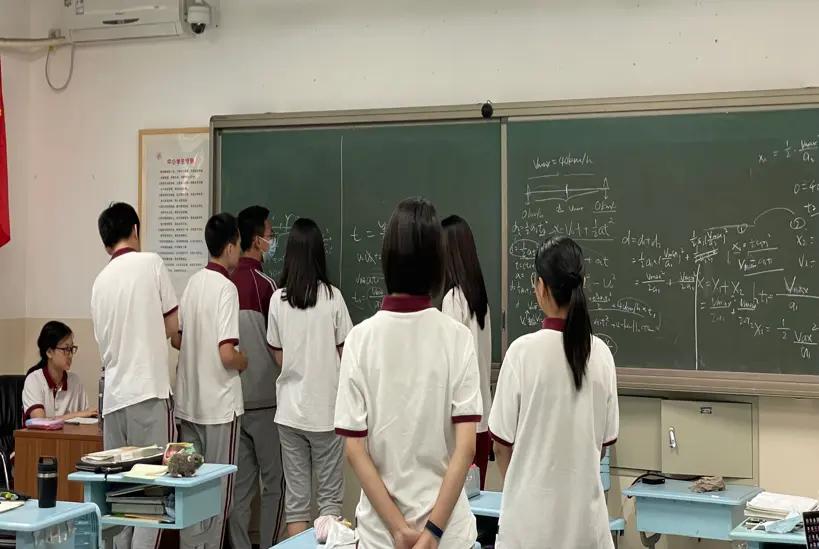
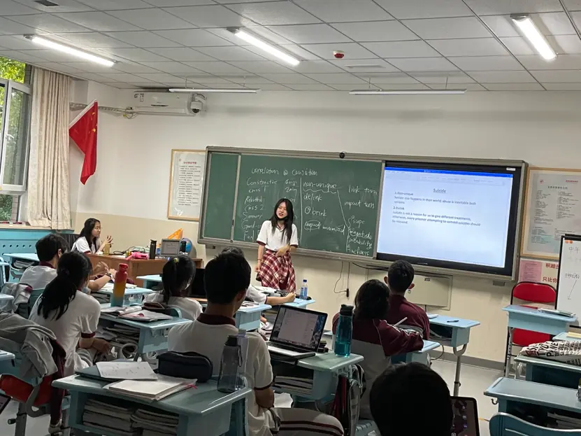
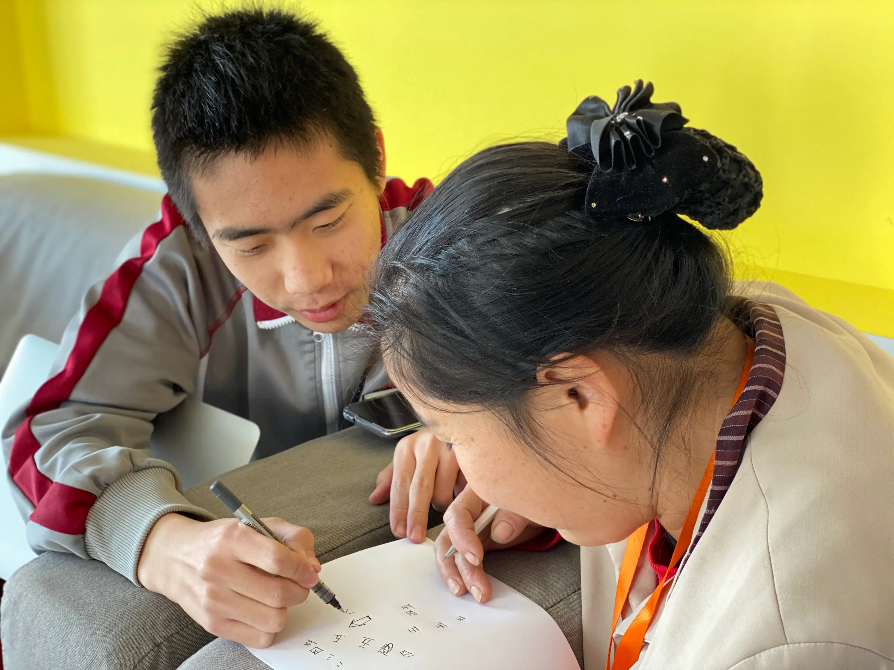
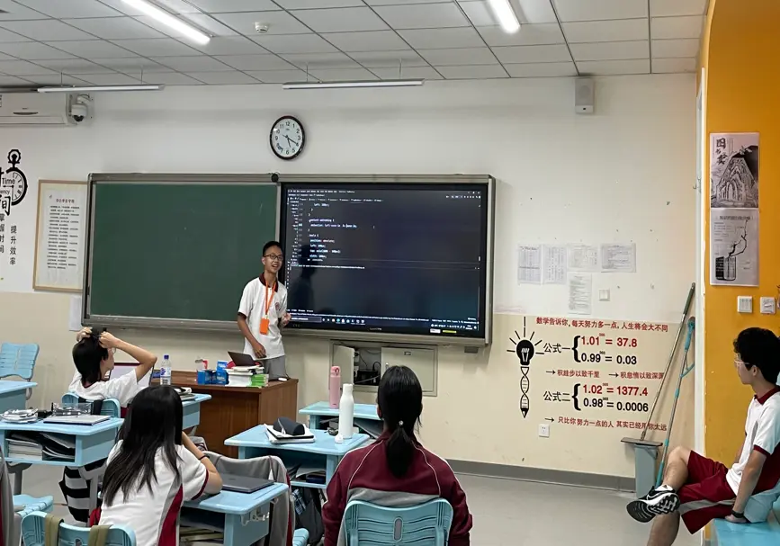
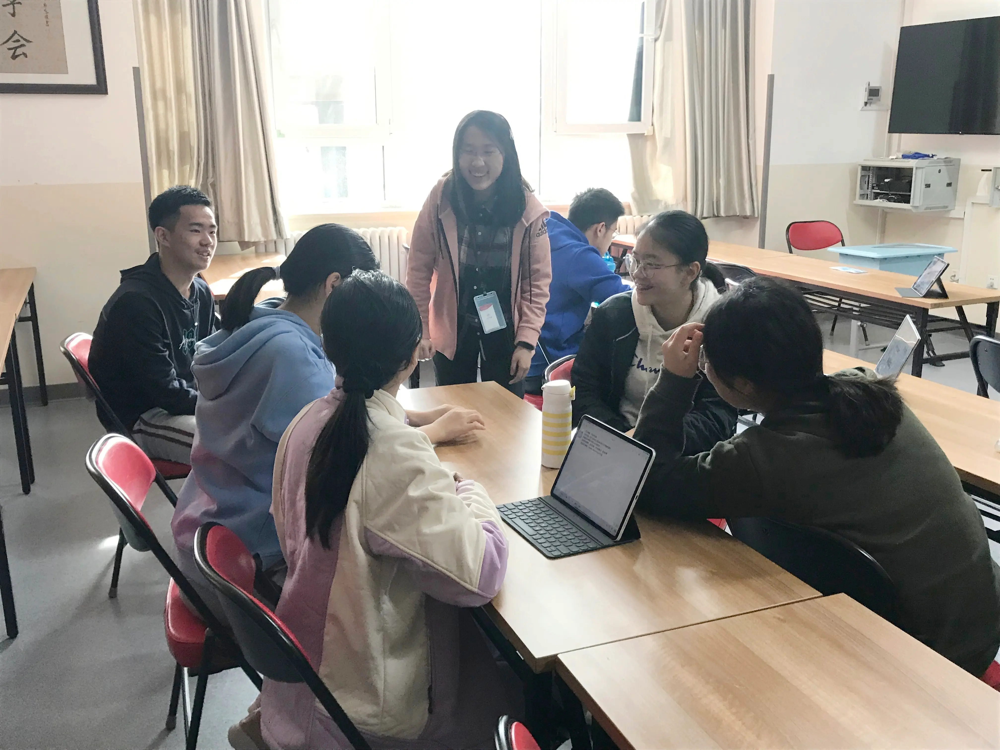
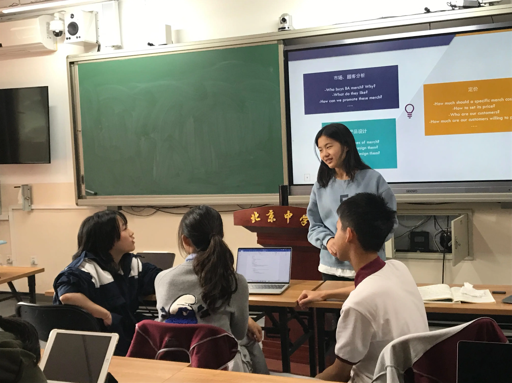

## 数学建模社团

从开学以来加入建模社，社长带领我们探究了实际中会出现的问题进行了建模，每次的课程都会从不同的角度出发，最后在建模中所需要的知识也是来自于不同领域的。有的时候可能会用到数学和物理公式，有的时候又会需要带入实际数值带入计算，社长从通俗易懂的角度带着我们这一些建模新手慢慢深入数学建模这个充满神秘色彩的领域。当然，在探究的过程中又总不会是一帆风顺的，我们会遇到很多问题，比如会有很多未知数的设置导致最后无法找出能够表达出来且较容易计算的公式，但是社长每次都会设置出不同种类的方法引领我们发散思维，由繁化简，每每都会带领我们找到最终的答案，而探索的过程也没有枯燥的感觉，每一个社员脸上都洋溢着解出正确答案的喜悦，社团的气氛也很缓和，梁老师也会提供思路和方法，并且也会做出一部分指导，我很期待以后更多有趣的题目！

## 羽毛球社团

在本学期羽毛球社团的活动当中，我们学习到了很多关于羽毛球的基础知识，从高远球到发球，社团中的老师和负责人教导了一步一步地从零开始培训我们的基础知识。学习的模式大致是从动作到练习到实战。每节课开始，首先都是热身准备，为了保证同学们在活动过程中的安全，绕场跑圈以及准备活动都是必不可少的。之后就是动作训练，我们会在场地里练习挥拍巩固我们的动作，我们会重复发球和高远球的动作，并且在这一过程中不断。之后我们会根据高级组和初级组分开练习，初级组的同学会去一边场地两两一组练习接发球，一个同学发球另一个同学接球，让双方都得到锻炼。然后高级组的同学会在另一边场地进行实战演练，在实战中磨练自己的技巧并且积累实战经验。在社团过程中，我们大家其乐融融，十分和睦，在学习羽毛球技术的同时也结识了很多国际部的朋友。最近我们还有市里的羽毛球比赛机会，我们大家都会积极参与，在竞争中成为更好的自己。

我从小就对运动情有独钟，无论是跑步、篮球都会涉猎，就算是羽毛球也和家人学习并“比赛”过。只不过并没有系统性的学习，只是知道正手打和反手打。一直到了高中，才在校园中遇上了打羽毛球的专业同学。虽然说能够和他们交火几个来回，但是感觉动作并没有他们标准（帅），有效。这不，选择了羽毛球社团。

社长和副社长一开始就教学羽毛球的各种动作。动作极不规范的我需要一步一步分阶段学习。期间有的动作总是改不过来，但教我的副社长悉心指导，不断鼓励我。毕竟是热爱体育运动的人，在一旁不断挥拍练习的我每节课下来确确实实很疲劳，但是我能够理解这是新手成长的必经之路。总共几节课下来，我发现社长、副社长讲了很多很多的动作，现在平常走在路上还会练习练习。

## 演讲与辩论社团

辩论社使我有了很多的体会和收获，辩手必须具备良好的语言能力，快的反应能力，严密的逻辑能力。团结的力量大，只有互相协作才能到达成功的彼岸。在这里，我提高了自己，了解了辩论，认识了辩论，锻炼了思维，加强了同学们的交流、友谊。它使我深度的思考。在参加辩论社之前，我认为辩论并不困难。但是真正见识到高手之后，我甘拜下风。极高的英语水平加上巨快的语速再配上无法反驳的观点，简直无懈可击。同时，辩论并不是个人独秀。如果你想独自迎战，那你永远赢不了。毕竟，你面对的是一个团队。每个人都需要齐心协力，才能战胜对手，这非常锻炼团队能力。群雄舌战展雄风，针锋相对辩天下。希望以后在辩论社，我能学到更多。

## 模拟法庭社团

在本学期的模拟法庭社团当中，我们学习到了很多关于模拟法庭的基本知识，丰富并且提升了我们自己的实战技巧。本学期我们还是和之前一样，参加了北京高中模拟法庭联赛。由于今年疫情的原因，这回的比赛模式采用的是线上赛的方式，我们在几周之前提前准备了好了我们的稿件，于国庆假期中参与了本次比赛。这回比赛我们社团这学期来的两个新人也参与了进来，所有的老社员都带领着一个自己对应的新同学，一步步教导他们撰写模拟法庭的稿子并且不断排练。经过两天的竞争，最后我们取得了很好的成绩。在这学期的社团活动中，我更多地去学习了关于模拟法庭的知识，积累了比赛经验，我想我之后也会持续地参与到这项活动之中。同时，也感谢社长对我的指导和帮助，用自己晚上和周末的时间来帮助我们准备比赛。

## 扫盲计划

通过参加扫盲计划，我获得了以后从事教育专业的道路的预先体验，并且看着阿姨们逐渐学会知识收获了巨大的成就感。除此之外，我还从中学会关注世界，关注社会，学会帮助需要帮助的人；增强了与成年人沟通的社交能力；也交到了志同道合的朋友。参加扫盲计划是我非常宝贵的体验，令我收获颇丰。

## 生命拯救社团

我认为生命拯救Heart Saver是一个非常特殊的社团，它不同于我们学校现有的学术类、体育类或是公益类社团，反而在众多种类中另辟蹊径，展现出了独属于“急救”这个专业知识的魅力。现如今人们已经越来越认同学会急救措施的重要性，但是在许多的社区、学校，相关知识科普都在很短的时间、很少的次数中教授，我认为这样不足以起到一个让人们吸收完整的知识内容并且如果有需要时能在现实生活中真正发挥作用的目的。因此，像生命拯救Heart Saver这样的社团正是我们所需要的。因为是学生社团，所以我们可以在一个相对更放松、更有趣的环境下学习面对紧急情况的临场反应、急救前的相关装备穿戴方法、对病患情况判断等知识。因此，我认为这个社团不仅应该持续的开展，更应该扩大到全校层面，让更多的学生有机会接触这类学习并进行宣传、拓展。

## 计算机社团

北中的计算机社团让我收获了许多。计算机是我的爱好，但在平时，我并不是很擅长和别人一起交流学习。加入计算机社团后，我也发现了许多其他热爱计算机的同学。在一次次活动中，我们一起学习交流，协作完成项目。在融入集体的过程中，我也得到了成长和锻炼。今后我也会与大家一起，让我们的社团变得更好。

## 经济社

对经济感兴趣的同学们拓展economics/business相关知识，如市场营销，产品定价，品牌战略等，为同学们在北京中学孵化自己的企业—北中文创产品店 (BA Campus Store) 打下基础。此外，经济社帮助同学们备战经济学竞赛 (IEO, NEC, etc)，让同学们充分发展自己的兴趣。

